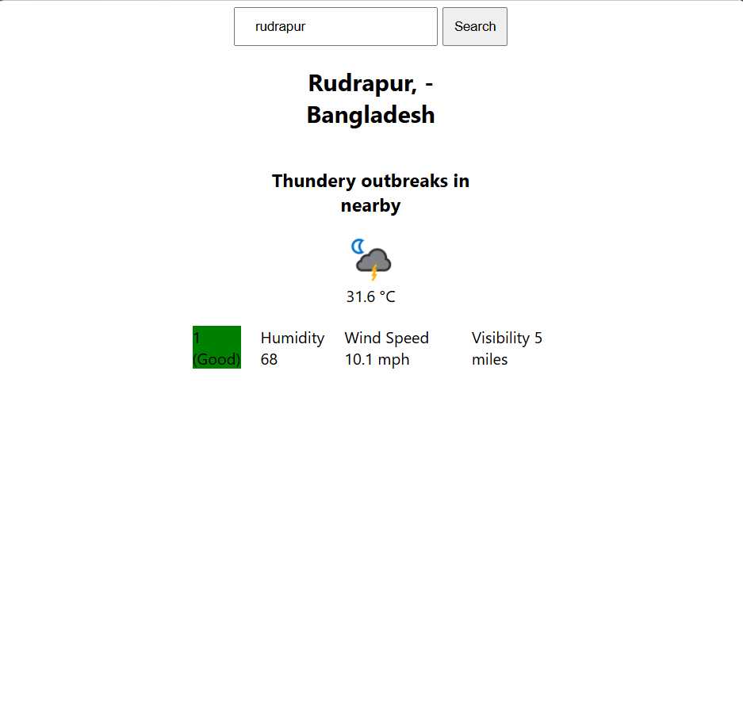

# 🌤️ Weather App
 
## 🙂‍↔️ Overview

 * Make a Weather app in HTML, CSS and Javascript . I just learing the integration of APi in frontend. I will make this app more beautiful and also turned it in to react vite setup...

## 🤯 Feature

* Real Time Weather Fetching..
* We can simply search for a city and see the weather of the city like temp humidity wind speed etc.

## 🤓 Tech Stack

* HTML5 - Structure
* CSS - Style
* JavaScript (ES6) - logic and api handling to fetch data.

## ScreenShots



## 🚀Getting Started

1. Open the Project Folder...

2. Go to terminal and clone the repository.

```bash
git clone https://github.com/manish354200/Weather-App.git
```

3. open `index.html` with live server

## 👨‍💻Author

Made by **Manish Yadav**
